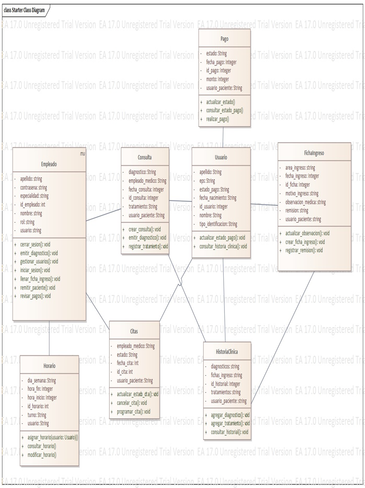

# Diagrama de Clases UML del Sistema

El diagrama UML del sistema describe cómo las diferentes clases interactúan entre sí, lo que permite una gestión eficiente de la información relacionada con los pacientes, empleados y los procesos administrativos en la clínica.

## Descripción

- **Usuarios**:
  - Cada usuario posee un **historial clínico individual**.
  - Los usuarios pueden crear múltiples:
    - **Registros de ingreso**
    - **Consultas médicas**

- **Empleados**:
  - Los empleados están relacionados con varios:
    - **Consultas realizadas**
    - **Citas programadas**

- **Registros de Ingreso**:
  - Cada registro de ingreso está vinculado a un único **historial clínico** de un usuario.

- **Consultas Médicas**:
  - Cada consulta médica está asociada a un único **historial clínico** de un usuario.
  - Las consultas también pueden estar conectadas a:
    - Usuarios (pacientes)
    - Empleados (médicos)

- **Historial Clínico**:
  - Es único para cada usuario y se vincula con múltiples:
    - **Registros de ingreso**
    - **Consultas médicas**

Este diagrama UML organiza las entidades de manera jerárquica y muestra sus relaciones, lo que facilita la comprensión de cómo la información se gestiona dentro del sistema.
## Diagrama UML

